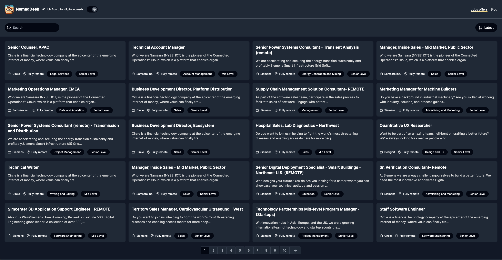
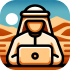

# NomadDesk - Remote first Job Board for Digital Nomads

Welcome to NomadDesk, job board dedicated to digital nomads seeking remote-only opportunities. Leveraging the latest in web technology, NomadDesk connects professionals with their ideal remote roles globally.

## Features

- **Real-Time Job Listings**: Fetching jobs from the Muse API, providing fresh and relevant opportunities.
- **Server-Side State Management**: Ensures a seamless and shareable app experience with URL-reflected app states.
- **Advanced NEXT.JS & React Features**: Utilizing NEXT.JS App Router and React Server Components for an optimized user experience.
- **Intensive Use of Server Components**: Enhancing efficiency and user experience with server-side processing.
- **Server-Side Network Calls**: All network operations are efficiently handled by the server, thanks to Server Components.
- **Markdown & MDX Remote for Blog Posts**: Creative blog posts are composed using Markdown and MDX Remote for dynamic content.
- **Code Highlighting with Bright**: Implements server-side code highlighting through the Bright package, offering rich, syntax-specific coloration done on the server.
- **Swing Animations with Framer Motion**: Leverages Framer Motion to create fluid, interactive swing animations, enhancing the user interface with sophisticated motion design.
- **Theme Resolved On The Server**: The app's theme (light or dark) is resolved on the server, eliminating theme flicker on app load.

## Tech Stack

- **Frontend**: NEXT.JS, React, TypeScript, TailwindCSS, CSS, Postcss, Framer Motion
- **Backend**: Node.JS
- **Content Creation**: ChatGPT-4 for blog writing, DALL-E for image generation
- **Others**: ESLINT, React-Feather Icons, Markdown, MDX Remote, Gray Matter, Bright

## Getting Started

To start exploring remote job opportunities with NomadDesk:
1. Clone the repository.
2. Install the required dependencies.
3. Start the development server and navigate to the local URL.

## Contribution

Your contributions are welcome!

## Contributors

- Przemysław Spławski 👉 [@splawskip](https://github.com/splawskip)

## Contact

For any inquiries or support, please contact me by choosing some possible contact option available on my profile.

## License

This project is licensed under the MIT License. See the [LICENSE](https://github.com/splawskip/NomadDesk/blob/main/LICENSE) file for more information.
